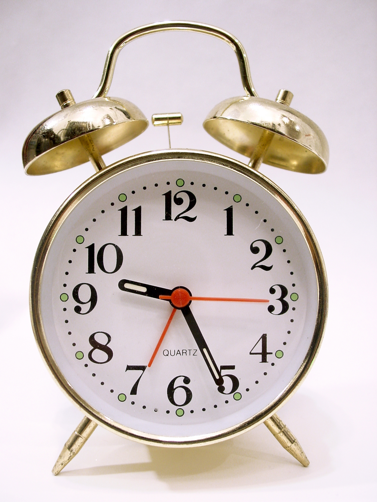

<style type="text/css">
.remark-slide-content {
    font-size: 40px;
    padding: 1em 4em 1em 4em;
}
</style>

```{r setup, include=FALSE}
knitr::opts_chunk$set(echo = FALSE,comment = NA)
xaringanExtra::use_xaringan_extra(c("tile_view", "animate_css", "tachyons"))
library(knitr)
library(kableExtra)

```

```{r}
xaringanExtra::use_webcam(width = 350, height = 350)
```


```{css, echo=F}
    /* Table width = 100% max-width */

    .remark-slide table{
        width: 100%;
    }

    /* Change the background color to white for shaded rows (even rows) */

    .remark-slide thead, .remark-slide tr:nth-child(2n) {
        background-color: white;
    }

.bold-last-item > ul > li:last-of-type,
.bold-last-item > ol > li:last-of-type {
  font-weight: bold;
}
```


# One Idea

- A rapid-fire talk is one idea
- Advertising rather than explaining
- Slow down
- Timing
- Practice

---

# Audience

Identify levels of: 

--

- interest

--

- engagement

--

- knowledge (and expertise)

--

Tailor your talk!
---

# Shorter is harder!

- Easiest talk length is ~ 30 minutes

--

- Then 1 hour

--

- Then 15 minutes

--

- Then 5 minutes.

--

- Practice!

---

# Timings?

```{r, echo=FALSE, out.width="55%", fig.alt="Alarm Clock", fig.align='center'}

```

---

# Format of talk?

- Online

--
- In-person

--
- Hybrid

--

How do the audience watch?
- Live

--
- Recorded

--
- Pre-recorded?

---

# Good accessibility practices

- Provide link to slides at start!

<https://github.com/dtoher/YSStalk>

- Alt text for images
- Have your link on twitter.

---

# Afterwards

- Be available for questions!

- Don't plan on being anywhere else for at least 30 minutes after the talk.
